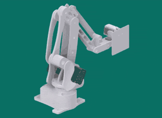
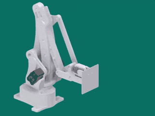
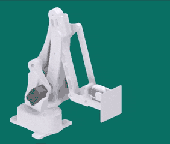
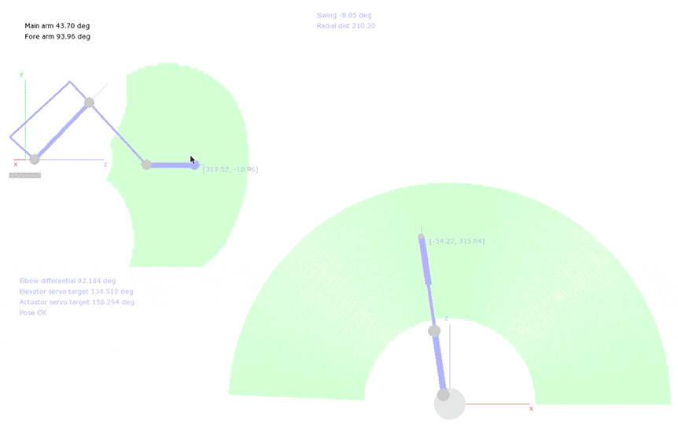
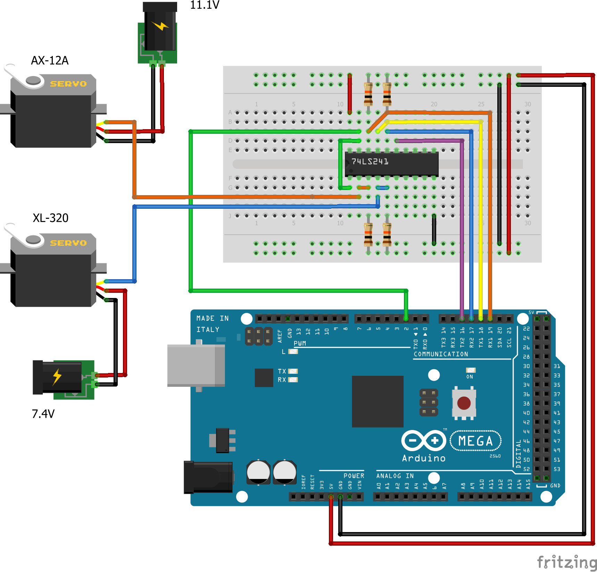
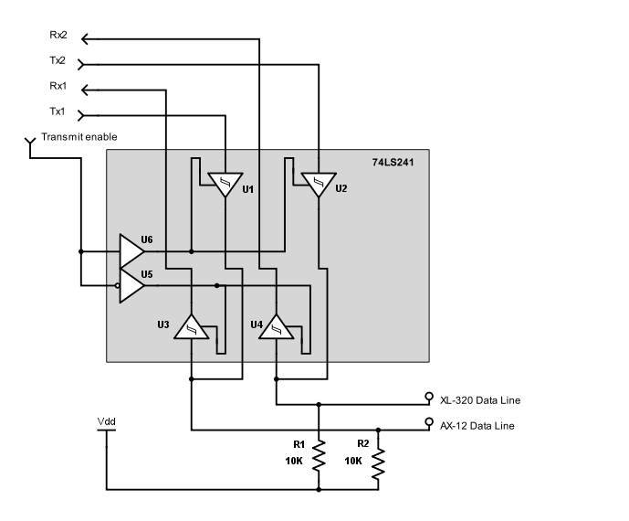

EvoArm is an open-source, 3D-printable, desktop-sized, 3+2DOF robot arm design which uses serially controlled Dynamixel smart servos. It is based in part on the [LiteArm i2](http://www.thingiverse.com/thing:480446) design by "Armatec".

[Licensed under CC-BY-SA 3.0](https://creativecommons.org/licenses/by/3.0/)

## Core Action
Swing | Main Arm | Actuator/Forearm
--- | --- | ---
 |  | 

The arm is actuated using 3 Dynamixel smart servos, either the [AX-12 or 18A](http://support.robotis.com/en/product/actuator/dynamixel/dxl_ax_main.htm), which both have identical casings and control protocols - I recommend using AX-18A motors, as the 12s are a bit underpowered.

## Effector
The design presented here has a flat touchpad actuated using 2 Dynamixel [XL-320](http://support.robotis.com/en/product/actuator/dynamixel_x/xl_series/xl-320.htm) servos, providing an additional 2DOF at the arm's "wrist". The design inherently keeps the base wrist joint level with the floor.

## Inverse Kinematics
The inverse kinematics application is written in Python with [PyGame](http://pygame.org/hifi.html), and takes the form of a graphical control app which also accepts simple streamed commands from other programs via UDP. It serves the purpose of calculating the desired target servo positions for the arm, given a 3D target position and orientation for the end-effector. It also provides linear interpolation on the target position and basic bounds-checking to prevent self-interference on the motors or mechanical failure of the design (the reachable volume is visualised in green).

Start the application with `python PyIK` from the root directory. Unfortunately the application may not be usable on smaller screens, since the size is fixed. To enable control, press the spacebar, and watch the command window in which the app was started for additional information.

The IK app is configured to connect to the arm through a properly configured Arduino Mega2560 controller, from a Windows machine. More details to come!

## Hardware
The current system interfaces with the servos using an Arduino Mega2560, which provides multiple hardware UARTs in addition to the one used for PC/Arduino communications. The AX and XL series servos use different control protocols, so they are connected to the Arduino on physically separate lines, with one UART Tx/Rx pair for each *set* of servos. Since the servos use only a single (synchronous) data line, the Tx/Rx lines are multiplexed using a 74LS241 tri-state buffer. The multiplexing is controlled using an additional transmit enable line from the Arduino.

  

The data lines should be pulled high (to +5V) to stop them from "floating" while not in use.

Experimentally, it's possible to interface with these servos using only an Arduino Uno (or equivalent, e.g. Arduino Nano), without preventing the use of the single hardware UART for PC/Arduino communications. The ATMega328p in those boards is clocked high enough to allow basic *software-based* synchronous serial at 1 megabaud, using only one pin for each data line, and *no additional hardware*. The downside is interfering with the interrupts on the board, which can break some of the normal Arduino timing routines. If all you want to do is communicate with the servos from a PC, this doesn't matter. I'll explore this option further when I have the chance.
